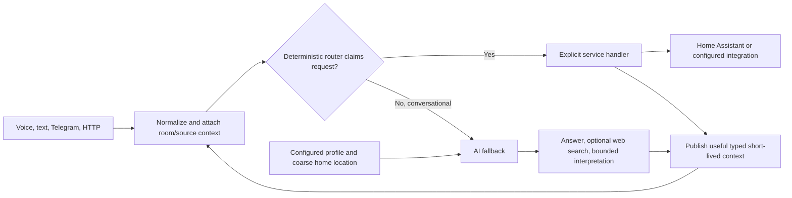

# Home Suite

**A self-hosted, room-aware command layer for Home Assistant across voice,
text, and companion clients.**

Home Suite gives your Home Assistant setup one context-aware command brain. It
understands rooms, active media, configured devices, and recent interaction
context, then routes known actions through explicit handlers instead of letting
an LLM improvise with your home.

Home Assistant remains the source of truth for entities, areas, scenes, scripts,
and state. Home Suite adds a shared language and interaction layer above it, so
you can speak in terms of what you want without losing the ability to name a
specific device when precision matters.

> **Status: Beta.** Home Suite is a daily driver in its original deployment and
> now has browser-first setup and management, authenticated control surfaces,
> automated command-contract coverage, and real-hardware validation on
> representative Raspberry Pi nodes. Home Assistant topology, audio hardware,
> and optional provider authorization remain deployment-specific.

## Room Context In Practice

People usually think in rooms and intentions rather than entities and service
calls. Home Suite can coordinate a configured room's lights, speakers,
television, and current media state.

| You say | How Home Suite resolves it |
| --- | --- |
| `pause` | Pauses the focused or currently active player for the request's room. |
| `what's playing?` | Reports media from the appropriate configured player. |
| `turn it up` | Adjusts the focused media target instead of every speaker at once. |
| `turn off the lights` | Uses the request's room unless you name another room or device. |
| `lights to 30%` | Applies the room's configured area, entity-list, or proxy brightness strategy. |

Fixed voice devices can have a default room, while mobile clients can carry
sticky room focus. Explicit commands such as `turn off the kitchen pendant`
remain available when room-level control is not specific enough.

See [Room configuration](docs/ROOM_CONFIGURATION.md) for the topology model and
[Commands](docs/COMMANDS.md) for phrases supported by the current router.

## What It Can Do

Current capabilities include:

* plain-English control for Home Assistant lights, switches, locks, covers, fans, thermostats, vacuums, scenes, scripts, and state
* room-aware defaults and sticky room focus for fixed and mobile command sources
* media and transport focus across Sonos, Apple TV, Plex, Spotify, and YouTube
* playback by title or description, resolved against real libraries and services
* announcements and assistant speech routed locally or through room speakers
* alarms, editable timers, reminders, and clock- or solar-based Home Assistant actions
* queryable temporary light colors, brightness, and on/off state with verified restoration
* Home Assistant calendar agendas, named-event queries, and confirmed event creation
* deterministic date, time, weather, straight-line distance, sun, moon, lunar-phase, and planetary questions
* optional read-only stock quotes, daily movement, prior closes, and U.S. market hours
* homelab status through Home Assistant and optional direct service APIs
* bounded conversational phrasing, corrections, and ambiguity clarification for deterministic commands
* source-scoped continuity across deterministic actions, readbacks, and AI conversation
* reusable source-scoped confirmations for long-running and sensitive actions
* optional persistent user profile and coarse home context for conversational answers
* optional web search for current questions such as news and recent events
* HTTP and WebSocket APIs for companion clients
* an authenticated browser console for guided management, diagnostics, and live Chat

See [Features](docs/FEATURES.md) for the broader overview and
[Integrations](docs/INTEGRATIONS.md) for service-specific behavior.

## Voice And Interaction

Push-to-talk and wake-word appliances feed the same interaction and routing
layers used by text clients. Trigger-specific audio mechanics remain isolated
so tuning wake-word behavior does not silently alter PTT.

The voice stack includes:

* persistent, per-device microphone profiles with guided browser or CLI calibration
* continuous wake-word capture with same-stream command handoff
* streaming speech-to-text with bounded fallback behavior
* VAD-based speech start and endpoint detection
* configurable OpenWakeWord models, thresholds, near-miss logging, and rearm policy
* wake-word-only asynchronous speech and barge-in support
* silent `cancel` and `never mind` interaction dismissal

Hardware still matters. Far-field arrays with beamforming and acoustic echo
cancellation can substantially improve room-scale detection and interruption
while the assistant is speaking.

See [Wake-word audio](docs/WAKEWORD.md) for wakeword setup, calibration,
diagnostics, and tuning, or [PTT handset setup](docs/PTT.md) for the current
hook-switch and capture contract.

## How It Works



Known actions are carried out by handlers constrained to configured rooms,
devices, and services. AI can answer questions, summarize, search the web, and
help resolve bounded descriptions, but it is not given an unrestricted tool for
inventing entities or arbitrary Home Assistant service calls.

Persistent profile and home context are separate from short-lived dialogue
state. Conversational calls can receive an optional preferred name, coarse home
area, timezone, and response preferences, while exact coordinates stay local
to deterministic weather, location-distance, and astronomy calculations.

Most routine control commands do not require an AI call. This keeps common paths
faster, cheaper, easier to test, and more predictable.

## Design Principles

* **Home Assistant first:** improve entities, areas, scenes, scripts, and names there before adding special cases.
* **Context before repetition:** use room, source, active media, and recent intent to resolve short commands.
* **Deterministic execution:** known actions follow explicit, inspectable routes.
* **Explicit approval:** protected actions use typed, expiring confirmations that never fall through to AI.
* **AI where it earns its place:** conversation and bounded interpretation, not unconstrained home control.
* **One runtime, many surfaces:** every frontend feeds the same command and interaction layers.

## What It Is Not

* **Not a replacement for Home Assistant.** It depends on your existing installation for devices and state.
* **Not a fully local assistant.** The runtime is self-hosted, but features can use OpenAI, gTTS, Spotify, Telegram, and other network services.
* **Not an unconstrained LLM controlling your home.** AI-assisted interpretation feeds bounded resolvers and configured integrations.
* **Not limited to room-level commands.** Direct device and explicit-room commands remain available.

## Quick Install

On a Raspberry Pi or Debian-like host:

```bash
curl -fsSL https://raw.githubusercontent.com/jayore/HomeSuite/main/scripts/install.sh | bash -s -- --start
```

The installer prints the management-console address, usually
`http://<homesuite-host>.local:8766`. Open it, create the first console
passphrase, and follow **Setup** to connect Home Assistant, review a room,
choose this node's roles, configure audio when needed, try a safe text command,
and activate the runtime. The live service remains stopped until required
Home Suite Doctor checks pass.

Existing configured nodes open normally and show Setup as complete. They can
use **Preview onboarding** to inspect the fresh-install journey without writing
configuration or operating services. The terminal editor and CLI Doctor remain
available as advanced fallback paths, but they are not required for a normal
fresh install. See
[Management console](docs/CONSOLE.md) for authentication, configuration
backups, service operation, and the browser Chat contract.

Start with [Getting started](docs/GETTING_STARTED.md) for the guided path or
[Install](docs/INSTALL.md) for all installer and systemd options.
For a role-specific target and a concrete first-run checklist, see
[Deployment roles](docs/DEPLOYMENT_ROLES.md) and
[Acceptance checks](docs/ACCEPTANCE.md).

**Name note:** the user-facing name is **Home Suite**. The repository, install
directory, service, and shell commands use `HomeSuite` or `homesuite` as
technical identifiers.

## Configuration And Requirements

The portable core runtime needs CPython 3.9 or newer, Home Assistant, a
long-lived Home Assistant token, and the generated local configuration files.
Experimental applets can add platform-specific dependencies and are documented
separately. An OpenAI API key is required for the currently supported OpenAI
speech and conversational paths, including web search, but not for text-only
deterministic commands.

Home Suite separates configuration by responsibility:

* `app_config.py` - tracked application defaults
* `deployment_config.py` - ignored shared topology and home-specific catalogs
* `private_config.py` - ignored credentials, tokens, service URLs, and API keys
* `local_prefs.py` - ignored per-device room, audio, hardware, and behavior overrides

Only the corresponding `*.example.py` templates are committed for local files.
Optional integrations can remain blank; unavailable services should be reported
without preventing the core runtime from starting.

The browser console owns normal setup and maintenance through feature-specific
pages. Specialized catalogs, thresholds, and low-level policy remain available
as documented file-managed settings and appear in the console inventory when
active; direct editing is an advanced or recovery path, not a first-run
requirement.

See [Configuration](docs/CONFIGURATION.md),
[Credentials](docs/CREDENTIALS.md), and
[Room configuration](docs/ROOM_CONFIGURATION.md).

## Ways To Talk To It

The same command brain can be reached through:

* a local Raspberry Pi PTT or wake-word voice appliance
* the `homesuite` command (`doctor`, `test`, `repl`, `logs`, and support tools)
* the authenticated management console and browser Chat on port `8766`
* `pptest`, `pplive`, `ppchattest`, and `ppchat` legacy compatibility aliases
* HTTP `POST /command` and WebSocket `/ws`
* Telegram
* scheduler and alarm jobs
* physical button mappings
* companion clients such as Raycast or a menu-bar app

Companion clients can live separately as the ecosystem grows. This repository
contains the Home Suite runtime, API, installer, and documentation.

## HTTP API

When enabled, the in-process server exposes:

* `GET /health`
* `GET /healthz`
* `GET /manifest`
* `GET /state/{room_id}`
* `POST /command`
* `GET /ws`

The server is enabled by default and fails closed when
`HOMESUITE_HTTP_API_KEY` is blank. `/health` and `/healthz` are public for
monitoring; all state, command, manifest, and WebSocket routes require the
shared key.

```bash
curl -sS http://homesuite.local:8765/command \
  -H "Content-Type: application/json" \
  -H "X-API-Key: $HOMESUITE_HTTP_API_KEY" \
  -d '{"text":"turn on the living room lights"}'
```

Telegram loads the shared Home Suite command runtime in a companion service and
does not require this API. Raycast, satellites, menu-bar apps, and custom
clients do. See [API](docs/API.md) for the request, response, WebSocket, and
authentication contract.

## Status

Home Suite is beta software and a daily driver in its original deployment. Its
normal fresh-install path is browser-first, and the same console supports later
configuration, diagnostics, integration testing, and runtime activation. The
portable full test suite runs on CPython 3.9 and 3.13; representative Pi 3B PTT
and Pi 4 wake-word/satellite nodes exercise the hardware paths.

Beta does not mean a turnkey consumer appliance. Each deployment still needs to
map its own Home Assistant rooms and entities, select compatible audio hardware,
and authorize any optional providers it uses. Direct file edits and log
inspection remain available for expert tuning and recovery rather than normal
onboarding.

The first supported target is a native Raspberry Pi OS or Debian-like
deployment. Docker packaging and a streamlined thin-satellite install may come
later.

## Project Guide

Important entry points:

* `main.py` - production runtime and voice interaction loop
* `command_dispatch.py` - deterministic natural-language routing pipeline
* `interaction_flow.py` - shared interaction and response policy
* `unified_server.py` - in-process HTTP and WebSocket server
* `console_server.py` - separate authenticated management console and browser Chat
* `tools/homesuite_cli.py` - canonical node CLI behind the `homesuite` command
* `command_repl.py` and `tools/test_commands.py` - safe and live command harnesses

Documentation:

* [Getting started](docs/GETTING_STARTED.md)
* [Install](docs/INSTALL.md)
* [Configuration](docs/CONFIGURATION.md)
* [Credentials](docs/CREDENTIALS.md)
* [Management console](docs/CONSOLE.md)
* [Integrations](docs/INTEGRATIONS.md)
* [Features](docs/FEATURES.md)
* [Commands](docs/COMMANDS.md)
* [Deployment roles](docs/DEPLOYMENT_ROLES.md)
* [Acceptance checks](docs/ACCEPTANCE.md)
* [Operations](docs/OPERATIONS.md)
* [Updating](docs/UPDATING.md)
* [Roadmap](ROADMAP.md)
* [HTTP and WebSocket API](docs/API.md)
* [PTT handset setup](docs/PTT.md)
* [FAQ](docs/FAQ.md)

## Security

Home Suite can control your home. Treat Home Assistant tokens, API keys,
Telegram bots, and HTTP clients as sensitive control surfaces.

Never commit `private_config.py`, `deployment_config.py`, or `local_prefs.py`.
Deleting a secret in a later commit does not remove it from earlier Git history;
rotate any credential that has ever been committed.

The companion API binds to the local network without TLS. Keep it on a trusted
LAN or VPN, use the generated shared key, and do not expose port `8765` directly
to the internet.

## License

Home Suite is available under the [MIT License](LICENSE).
