# Wake Word Audio Guide

This guide documents the production wake-word path in Home Suite: microphone
selection, OpenWakeWord detection, command capture, Realtime transcription,
endpointing, calibration, testing, and troubleshooting.

Wake-word and push-to-talk (PTT) capture intentionally have separate policy.
They share command routing only after transcription. A wake-word tuning change
must use `WAKEWORD_*` settings or an explicitly wake-word-only option; it must
not change handset/PTT timing unless that change is deliberate and tested.

## Pipeline

```mermaid
flowchart LR
    Mic["Microphone: PCM at device rate"] --> Ring["ContinuousAudioSource: 10 ms frames and ring buffer"]
    Ring --> Detect["WakewordFrontend: detector cleanup and 16 kHz resampling"]
    Detect --> OWW["OpenWakeWord model plus VAD gate"]
    OWW -->|hit| Handoff["Sequence cursor plus bounded pre-trigger tail"]
    Handoff --> Arbitrate["Optional brain arbitration before cue and STT"]
    Arbitrate -->|winner or one node| Capture["Wakeword command VAD and non-blocking cue"]
    Arbitrate -->|loser| Suppress["Silent re-arm"]
    Capture --> RT["Realtime transcription: 24 kHz PCM, manual commit"]
    Capture --> WAV["16 kHz diagnostic and fallback WAV"]
    RT --> Text["Prefix stripping, normalization, and phonetic repairs"]
    WAV --> Text
    Text --> Router["Deterministic command router"]
    Router --> Action["Home Assistant or configured integration"]
    Action --> Rearm["Success/error cue, stream flush, and re-arm"]
```



The important runtime properties are:

* The microphone is opened once and drained continuously. Detection and command
  capture use independent sequence cursors over the same bounded ring.
* OpenWakeWord receives 16 kHz chunks even when the hardware runs at 44.1 or
  48 kHz.
* Detection can hand command capture audio from immediately after the hit, plus
  a small pre-trigger tail for one-breath phrases such as `Hal turn off the
  kitchen light`.
* The acknowledgement cue is non-blocking. Audio is still buffered and sent to
  Realtime while the cue plays.
* A satellite announces its wake candidate before the cue or STT. One connected
  wake node receives an immediate grant; a multi-node cluster briefly compares
  confidence and signal quality while each local ring continues buffering.
  Losing nodes re-arm silently and never enter command capture.
* Local wake-word VAD owns the utterance boundary. Realtime server VAD is
  disabled for this path and the complete utterance is committed once.
* Text then enters the same normalization, phonetic repair, device resolution,
  and deterministic command routing used by other command surfaces.

## Module Ownership

| Module | Responsibility |
| --- | --- |
| `audio_input_profile.py` | Stable microphone selection, sample rate, mixer gain enforcement, and per-path frontend settings |
| `wakeword_audio_source.py` | One continuous PortAudio input stream with independent sequence cursors |
| `wakeword_frontend.py` | Resampling and optional detector/command cleanup |
| `wakeword_openwakeword.py` | Canonical OpenWakeWord runtime, model selection, scoring, hysteresis, and detector-to-command handoff |
| `wakeword_listener.py` | Engine lifecycle, suppression, callback contract, and Porcupine compatibility |
| `wakeword_arbitration.py` | Brain-side candidate grouping, quality scoring, winner leases, and duplicate-command protection |
| `satellite_coordination.py` | Persistent authenticated candidate/decision channel on a wake-word satellite |
| `audio_capture.py` | Shared VAD machinery with opt-in wake-word rolling endpoint policy |
| `realtime_streaming_stt.py` | 24 kHz Realtime transcription sessions and completed-WAV replay |
| `main.py` | Wake-word interaction policy, cue playback, STT fallback, routing, tones, and re-arm |
| `tools/calibrate_mic.py` | Repeatable microphone level measurement |
| `tools/wakeword_lab.py` | Labeled sample capture, replay, and threshold analysis |

`wakeword_openwakeword.py` is the active OpenWakeWord implementation. Older
engine code retained in `wakeword_listener.py` is not the canonical path.

## Multi-Device Arbitration

Set `COMMAND_PROCESSING_MODE = "satellite"` and `SATELLITE_BRAIN_URL` on each
wake-word frontend that should share a command brain. Arbitration is enabled by
default. All participating devices must point to the same brain and authenticate
with its companion API key.

The brain dynamically reports how many eligible wake nodes are connected. With
one node, `WAKEWORD_ARBITRATION_ELECTION_WINDOW_MS` is skipped and logs show
`hold_ms=0`. With multiple nodes, the default `180` ms window lets overlapping
detections arrive before the brain chooses a winner. Command audio is not lost
during that interval because the continuously drained local ring keeps filling.

The election is based primarily on wake confidence and speech-to-background
separation, with loudness as a smaller signal and clipping as a penalty. This
avoids simply rewarding whichever microphone has the highest gain. If every
candidate cannot provide comparable quality telemetry, that election falls back
to model confidence for all nodes.

Useful logs are:

```text
SATELLITE_COORDINATION_READY ... nodes=1 election_window_ms=180
WAKEWORD_ARBITRATION_ROUNDTRIP ... disposition='granted' ... hold_ms=0
WAKEWORD_ARBITRATION_DECISION ... disposition='suppressed' winner='kitchen'
```

The advanced controls live in **Wake word > Settings > Multi-device
coordination**. Keep NTP enabled on every Pi. PTT bypasses this channel entirely.

## Install OpenWakeWord

OpenWakeWord is optional because many Home Suite devices are text-only or PTT
only. Install it in the project virtual environment on a wake-word device:

```bash
cd ~/homesuite
homesuite install-wakeword
```

The regular audio dependencies come from `requirements.txt`. Always run Home
Suite tools with `.venv/bin/python`; the system Python does not contain the
project dependencies.

## Configure a Model

The preferred path is the management console's **Wake word** view. It lists
the `.onnx` models found on this node, makes clear which ones are active, and
allows multiple local models to be selected together. Drag a compatible
OpenWakeWord `.onnx` file onto the upload area or choose it with the file
picker. The console validates and stores it under the ignored local
`wake_models/` directory; uploading does not activate it automatically.

Review and save the selection, then use the console's **Restart required**
action to reload `homesuite.service`. Deactivating a model leaves its file in
place. A model uploaded through the console can be removed after it is no
longer active.

For headless or advanced configuration, put custom model files outside the
public repository or in another intentionally managed local directory. Then
set the device-specific values in `local_prefs.py`:

```python
WAKEWORD_ENABLED = True
WAKEWORD_ENGINE = "openwakeword"
WAKEWORD_MODEL = "hal_v2"
WAKEWORD_MODEL_PATHS = [
    "/home/your-user/wake_models/hal_v2.onnx",
]

# Tune from labeled samples for this model and room.
WAKEWORD_THRESHOLD = 0.5
WAKEWORD_VAD_THRESHOLD = 0.5

PTT_ENABLED = False
```

To recognize several custom wake words, list every model path and leave the
single-label filter blank:

```python
WAKEWORD_MODEL_PATHS = [
    "/home/your-user/homesuite/wake_models/hal_v2.onnx",
    "/home/your-user/homesuite/wake_models/alternate_phrase.onnx",
]
WAKEWORD_MODEL = ""
```

The console writes this same representation. The OpenWakeWord process loads
the paths into one shared detector, rather than starting one microphone stream
per wake word.

At startup, confirm that the selected label is actually among the loaded model
labels:

```bash
journalctl -u homesuite.service -b --no-pager \
  | grep -E 'WAKEWORD_ENGINE_OPENWAKEWORD_(READY|MODELS)'
```

Do not tune the score threshold until the intended model is shown as loaded.
Loading a built-in fallback model by accident makes threshold work misleading.

## Configure the Microphone

Open the management console's **Audio** view for the guided path. It discovers
the node's capture hardware, displays stable ALSA IDs, and edits the same
`AUDIO_INPUT_PROFILE` used by the runtime. The direct-file equivalent is a
named profile in `local_prefs.py`. Profiles may omit unchanged fields; Home
Suite fills them from conservative defaults. Name matching is more stable than
a PortAudio index, which may change after a reboot or USB change.

```python
AUDIO_INPUT_PROFILE = {
    "name": "living_room_farfield",
    "device_match": "USB Microphone",
    "device_index": None,
    "sample_rate": 48000,
    "channels": 1,
    # PortAudio buffering policy. Keep "low" unless logs report input overflow;
    # "high" is still only tens of milliseconds on many USB microphones.
    "stream_latency": "low",
    "strict_device_match": True,

    # Optional ALSA mixer enforcement. Values and control names are
    # device-specific; omit them for mics with onboard gain.
    "alsa_card": "Device",
    "mixer_control": "Mic",
    "mixer_value": 7,
    "verify_interval_sec": 15,

    # Detector cleanup is independent from command/STT cleanup.
    "noise_suppression_level": 2,
    "auto_gain_dbfs": 0,
    "volume_multiplier": 1.0,
    "command_noise_suppression_level": 0,
    "command_auto_gain_dbfs": 0,
    "command_volume_multiplier": 1.0,

    # Informational capability flag. Home Suite does not currently provide a
    # synchronized software AEC reference path.
    "aec_mode": "none",
}
```

When `mixer_value` is configured, Home Suite applies it when the stream opens.
`verify_interval_sec` enables a guardian that restores the value if another
audio manager changes it. For a new microphone, create a new profile instead of
changing assumptions throughout the wake-word code.

`WAKEWORD_ENGINE_OPENWAKEWORD_IDLE_TICK` reports `status_count`,
`last_status`, and `cursor_drops`. A rising `status_count` with
`last_status='input overflow'` means PortAudio lost samples before they entered
the ring. Try `stream_latency = "high"` for that microphone and verify the
counter remains at zero across complete wakeword interactions. `cursor_drops`
instead means a scoring/capture consumer fell more than the retained ring
behind.

### Input and output sample rates are separate

The microphone profile controls capture. `HOMESUITE_ALSA_DEVICE` or the legacy
`PIPHONE_ALSA_DEVICE` controls local playback. Changing a microphone from 16 to
48 kHz does not change an MP3 cue's speed; cue playback is decoded by `mpg123`
and sent to the configured ALSA output independently.

## Calibrate Capture Gain

The recommended path is **Audio > Start calibration** in the management
console. It safely asks the running service to pause continuous wake-word
capture, records room noise and normal speech, and resumes the detector after
completion, cancellation, failure, or timeout. It does not change or save gain
automatically; use the results to make a deliberate reviewed edit.

For a headless node, stop the service so the CLI tool can own the microphone:

```bash
sudo systemctl stop homesuite.service
cd ~/homesuite
source .venv/bin/activate
python tools/calibrate_mic.py --list-devices
python tools/calibrate_mic.py --device 1 --show-alsa
```

The interactive run records room silence and normal speech, then reports peak,
RMS, block percentiles, and clipping. A healthy target is loud speech peaking
roughly between `-12` and `-3 dBFS` with no meaningful clipping. If the tool
reports clipping or a peak near `0 dBFS`, lower hardware gain. If speech is too
quiet, raise gain or improve microphone placement.

Useful variants:

```bash
# Match by a stable name rather than an index.
python tools/calibrate_mic.py --match "USB Microphone"

# Measure without first applying the configured mixer profile.
python tools/calibrate_mic.py --device 1 --no-apply-profile

# Save a speech sample for later inspection.
python tools/calibrate_mic.py --device 1 --wav-out /tmp/mic-speech.wav
```

After updating `AUDIO_INPUT_PROFILE`, restart the service and confirm the
profile was applied:

```bash
sudo systemctl start homesuite.service
journalctl -u homesuite.service -b --no-pager \
  | grep -E 'MIC_PROFILE|WAKEWORD_AUDIO_PROFILE|WAKEWORD_ENGINE_OPENWAKEWORD_READY'
```

## Manage Wake-Word Behavior in the Console

Open **Wake Word**, then choose **Settings** in the top bar. The editor keeps
the controls with the behavior they affect:

* **Detection** contains the engine and normal trigger thresholds.
* **Listening experience** contains cues, rearm behavior, media pausing, and
  spoken-response interruption.
* **Transcription** chooses completed-recording transcription and whether
  audio is streamed while local VAD is still listening.
* **Advanced detection** contains debounce and score hysteresis.
* **Advanced command capture** contains one-breath recovery, VAD handoff, and
  endpoint timing.

Home Suite previews these edits, validates related settings together, writes
device-local overrides atomically, and preserves an inherited-value reset for
existing overrides. The examples below remain useful for understanding and
recovery, but routine tuning no longer requires editing `local_prefs.py`.

## Command Capture and Endpointing

The wake-word path does not wait for the acknowledgement cue to finish before
recording. Two settings prevent the cue and detector tail from corrupting the
command boundary:

* `WAKEWORD_STREAM_CUE_GUARD_MS` keeps initial frames in pre-roll and Realtime
  streaming but does not let them start command VAD.
* `WAKEWORD_STREAM_ENDPOINT_*` uses a mostly-silent rolling window. An isolated
  false voice frame from room noise no longer resets the entire endpoint delay.

Current general-purpose defaults are:

```python
WAKEWORD_STREAM_CUE_GUARD_MS = 1000
WAKEWORD_STREAM_ENDPOINT_WINDOW_MS = 700
WAKEWORD_STREAM_ENDPOINT_MIN_SILENCE_RATIO = 0.70
WAKEWORD_STREAM_ENDPOINT_TRAILING_SILENCE_MS = 80
WAKEWORD_STREAM_MIN_SPEECH_MS = 250
WAKEWORD_STREAM_MAX_SECONDS = 8.0
```

`WAKEWORD_STREAM_MAX_SECONDS` is a failsafe, not an intentional delay. A normal
command should log `WAKEWORD_STREAM_VAD_ENDPOINT` well before that cap. Set
`WAKEWORD_STREAM_ENDPOINT_WINDOW_MS = 0` to restore strict consecutive-silence
endpointing for diagnosis.

The PTT caller does not enable the rolling endpoint or cue guard. Its existing
consecutive-silence behavior remains unchanged.

## Rearm After a Command

By default, Home Suite waits up to one second for a completion/error cue and
suppresses wakeword scoring while any sound effect plays:

```python
WAKEWORD_SUPPRESS_DURING_SFX = True
WAKEWORD_REARM_SFX_DRAIN_MAX_SEC = 1.0
```

On a device whose completion cue does not false-trigger its selected model, a
faster policy can preserve the cue while accepting another wakeword during its
tail:

```python
WAKEWORD_SUPPRESS_DURING_SFX = False
WAKEWORD_REARM_SFX_DRAIN_MAX_SEC = 0.0
```

The normal rearm floor, model deactivation frames, and debounce still apply.
Validate repeated commands and watch `WAKEWORD_REARM_READY`,
`WAKEWORD_TRIGGER_ARMED`, false detections, and PortAudio status counters
before keeping the faster policy.

## Barge-In During Assistant Speech

Wakeword barge-in lets a new detection stop local assistant speech and begin a
replacement command capture. It is wakeword-only; PTT keeps hang-up as its
authoritative interruption gesture.

Enable **Background spoken responses** and **Interrupt spoken responses**
together under **Wake Word → Settings → Listening experience**. The equivalent
device-local values are:

```python
ASSISTANT_AUDIO_OUTPUT_MODE = "local"
WAKEWORD_ASYNC_TTS_ENABLED = True
WAKEWORD_BARGE_IN_ENABLED = True

# Keep normal idle detection strict while allowing more sensitivity when the
# user's voice competes with assistant playback.
WAKEWORD_THRESHOLD = 0.75
WAKEWORD_BARGE_IN_THRESHOLD = 0.55
```

`WAKEWORD_BARGE_IN_THRESHOLD` is consulted only while local TTS is active and
barge-in is enabled. It does not lower the normal idle threshold. Start close to
the normal threshold and lower it only after reviewing real scores; an overly
low value can let speaker bleed or unrelated speech trigger the detector.

On a successful detection, Home Suite logs `WAKEWORD_BARGE_IN_STOP_TTS`, stops
the specific local player process it launched, and hands the same continuous
microphone stream into command capture.

Current boundaries:

* This interrupts **local TTS while speaking**. It does not yet cancel an
  arbitrary in-flight AI/network request during the thinking phase.
* Sonos/remote assistant output is not locally terminable by this path.
* Without acoustic echo cancellation, the wakeword model must recognize the
  user through the assistant's own speaker output. A separate speaking
  threshold helps, but hardware AEC is the robust solution.
* Completion-cue suppression and model rearm policy still apply before or after
  spoken responses as configured.

Test with long spoken responses, different distances, and phrases that resemble
the wakeword. Watch `WAKEWORD_NEAR_MISS`, `WAKEWORD_ENGINE_OPENWAKEWORD_HIT`,
`WAKEWORD_BARGE_IN_STOP_TTS`, and false activations before keeping a lower
speaking threshold.

## Realtime Transcription and Fallback

For live wake-word transcription:

```python
WAKEWORD_USE_STREAMING_STT = True
WAKEWORD_STT_MODE = "realtime_stream"
```

These are exposed as **Transcription service** and **Transcribe while
listening** under **Wake Word → Settings → Transcription**. The live-streaming
toggle is wake-word-specific and does not change PTT's process-wide STT mode.

The live session receives mono 24 kHz PCM during capture. It uses manual commit
because a pre-triggered wake-word prefix can otherwise be auto-committed as its
own server-VAD turn. The resulting transcript is written beside the WAV as a
sidecar file; `STT_PATH_USED ... method=sidecar` means the live Realtime result
was used, not that Whisper processed the file.

The fallback order is:

1. Live Realtime transcript produced during capture.
2. Completed-WAV replay through the same 24 kHz, manually committed Realtime
   adapter.
3. `whisper-1` file transcription as the final compatibility fallback.

Useful log markers are `STT_RT_STREAM_INIT`, `STT_RT_STREAM_APPEND`,
`STT_RT_STREAM_FINAL`, `STT_PATH_USED`, and `TRANSCRIPTION_TEXT`.

## Tune Detection with a Labeled Dataset

Score thresholds should be based on repeated samples, not one successful phrase.
Stop the service, then capture positive and negative examples:

```bash
sudo systemctl stop homesuite.service
cd ~/homesuite
source .venv/bin/activate

python tools/wakeword_lab.py capture --mode wake_only --phrase "Hal" --count 10
python tools/wakeword_lab.py capture --mode one_breath --phrase "Hal turn on the light" --count 10
python tools/wakeword_lab.py capture --mode paused --phrase "Hal ... turn on the light" --count 10
python tools/wakeword_lab.py capture --mode negative --phrase "similar words" --count 20
python tools/wakeword_lab.py capture --mode ambient --count 10

python tools/wakeword_lab.py replay --input-dir ~/wakeword_lab \
  --json-out ~/wakeword_lab/results.json
```

Replay uses the configured model and the same detector frontend as production.
Its threshold recommendation prefers no observed false accepts, then maximizes
positive recall. Collect across speakers, distances, room noise, and microphone
positions before adopting a result.

## Operational Checks

Follow the live path without dumping the entire journal:

```bash
journalctl -u homesuite.service -f -o cat \
  | grep -E 'OPENWAKEWORD_(HIT|READY|IDLE)|NEAR_MISS|STREAM_VAD|STT_RT|TRANSCRIPTION_TEXT|ACTION_DECISION|HA_DONE|REARM_READY'
```

Expected successful sequence:

1. `WAKEWORD_ENGINE_OPENWAKEWORD_HIT`
2. `WAKEWORD_STREAM_CAPTURE_BEGIN`
3. `WAKEWORD_STREAM_VAD_SPEECH_START`
4. `WAKEWORD_STREAM_VAD_ENDPOINT`
5. `STT_RT_STREAM_FINAL`
6. `TRANSCRIPTION_TEXT`
7. `HA_DONE` or another claimed action
8. `WAKEWORD_REARM_READY` and `WAKEWORD_TRIGGER_ARMED`

Run the focused regression suite after audio changes:

```bash
cd ~/homesuite
PYTHONPATH=. .venv/bin/python tests/test_wakeword_audio.py
.venv/bin/python tools/router_smoke_test.py
```

The audio tests explicitly verify that rolling endpoint behavior is opt-in and
that default/PTT accumulation still requires consecutive silence.

## Troubleshooting

| Symptom | Check | Likely action |
| --- | --- | --- |
| Wake word rarely triggers | `NEAR_MISS`, gain report, model label | Calibrate gain, confirm model, then tune threshold from a dataset |
| Commands lose their first word | pre-trigger and cue-guard settings | Keep one-breath pre-trigger enabled; avoid increasing cue guard without replay tests |
| Actions arrive at the maximum capture time | `STREAM_VAD_DONE`, endpoint logs | Inspect cue/room bleed; tune the wake-word rolling endpoint, not PTT silence |
| Transcript is one syllable or only the wake word | Realtime rate and turn mode | Confirm 24 kHz PCM and manual commit are active |
| `STT_PATH_USED` says `sidecar` | `STT_RT_STREAM_FINAL` immediately above it | This is the normal live Realtime path, not Whisper fallback |
| Cue is a short chirp | inspect the configured asset duration | Confirm `WAKEWORD_CHIME_SOUND_FILE`; microphone rate does not control MP3 playback |
| Gain changes after restart | `MIC_PROFILE_APPLY`, `amixer` | Configure mixer card/control/value and enable the guardian |
| Service cannot open the mic | device list and service ownership | Stop competing audio tools; prefer profile name matching over an index |
| Wake word retriggers on output | suppression and re-arm logs | Keep SFX suppression enabled; hardware AEC is preferred for far-field devices |

## Echo Cancellation

Home Suite currently supports detector noise suppression and separate optional
command cleanup, but it does not yet feed synchronized speaker-reference audio
into a software acoustic echo canceller. `aec_mode` records the microphone's
capability; it does not synthesize AEC.

A far-field microphone with hardware AEC should set `aec_mode = "hardware"`
after its echo cancellation is verified. Without hardware AEC, keep cue volume
reasonable, retain the cue guard and rolling endpoint, and test with actual
speaker-to-microphone placement. A future software AEC implementation must own
both playback reference frames and microphone frames on the same clock; adding
generic noise suppression is not an equivalent substitute.
